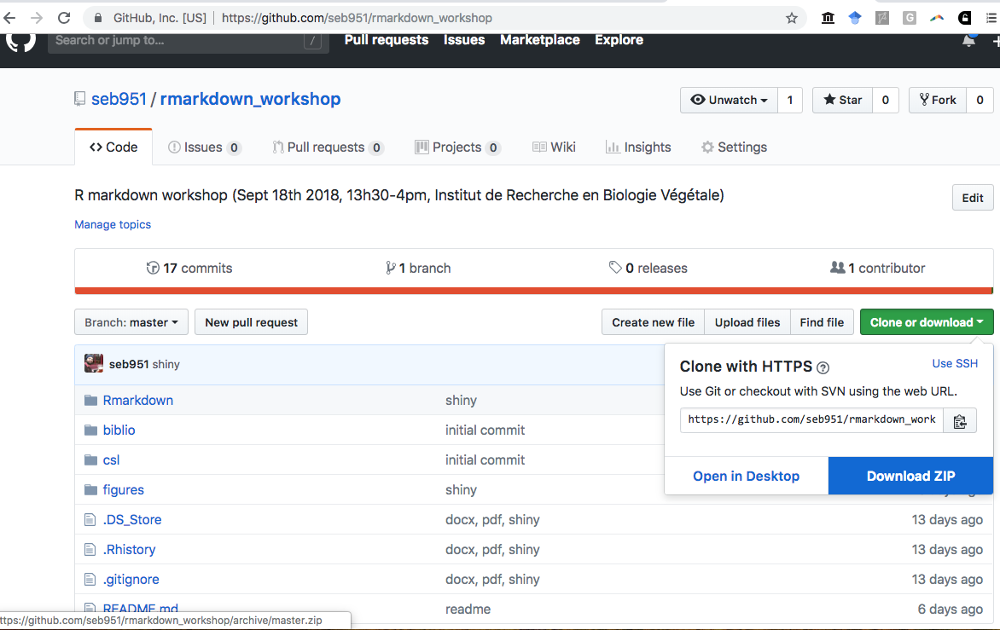
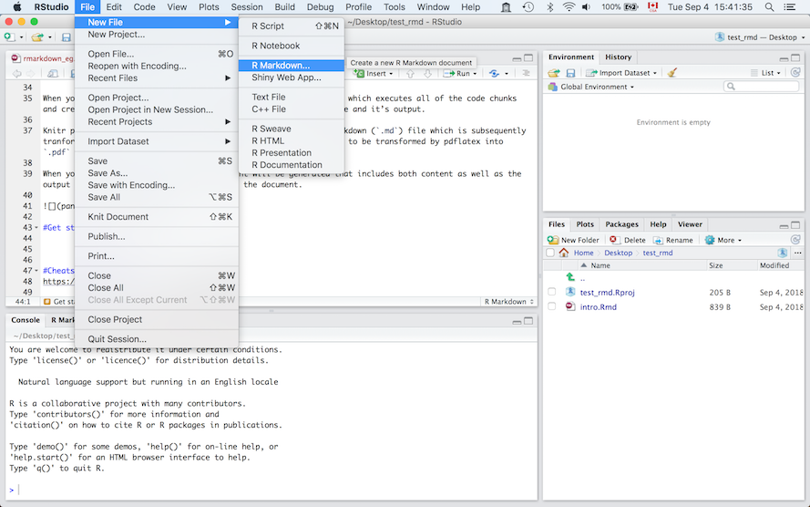
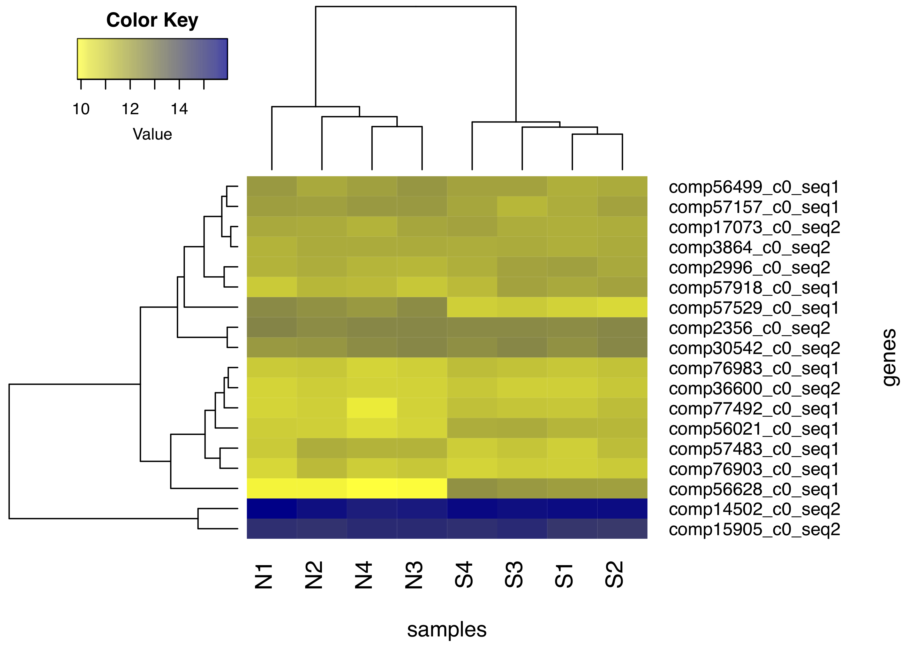

```{r setup, include=FALSE}
knitr::opts_chunk$set(echo = TRUE)
```

#Introduction  
• You can download the workshop material here (https://github.com/seb951/rmarkdown_workshop)  

• Follow the *.html* and the *.Rmd* document. Try and experiment.  

{width=500px}  
&nbsp;  
  
• ~1h00min: intro + html format    

• ~10min. pause  

• ~45min: other formats (.docx, .pdf, shiny app)  

• ~15min: shiny   

##Markdown
• Markdown is a **lightweight markup language** with plain text formatting syntax (*Easy-to-read, easy-to-write plain text format*). It is designed so that it can be converted to HTML and many other formats (e.g. PDF, MS Word .docx).  

• Example: https://github.com/seb951/rmarkdown_workshop/blob/master/README.md  

• It saves and executes code in order to generate fully reproducible reports in different of static and dynamic output formats.  

• Like other markup languages (e.g. HTML and Latex), it is completely independent from R.  

##R Markdown
• An extension of the markdown syntax.

• https://rmarkdown.rstudio.com/ (Yihui Xie)   

• Plain text files that typically have the file extension *.Rmd*.  

• Written using an extension of markdown syntax that enables **R code to be embedded in them in a way which can later be executed**.  

• The R package `rmarkdown` package feeds the *.Rmd* file to `knitr`, which executes all of the code chunks and creates a new markdown (*.md*) document which includes the code and output.  

• Subsequently tranformed into *.html*/*.tex*/*.docx* by `pandoc`. Note that *.tex* files need to be transformed by `pdflatex` into *.pdf* files. We'll come back to that later.  

• `rmarkdown`, `knitr`, and `pandoc` are built in `Rstudio`. `pdflatex` is not.  

• When you click the **Knit** button (top left),  a document will be generated that includes both content as well as the output of any embedded R code chunks within the document.  
{width=500px}

#Try it for yourself
• Set up an Rmarkdown file  
&nbsp;  
{width=500px}  
&nbsp;      
  
• file > new file > R markdown > HTML   

• Save it ("myfirstRmarkdown.Rmd")   

• Knit

• Let's look at html output. What happened?   

• Let's look at the `.rmd` file structure  

#Metadata (YAML Ain't Markup Language )
`---`  
`title: "Rmarkdown"`  
`author: "Sebastien Renaut"`  
`date: '2018-03-12'`  
`output: html_document`  
`---`  

• Why YAML (https://en.wikipedia.org/wiki/YAML#History_and_name) ?  

• It specifies what kind of document will be created, and the options chosen.   

• It is not required (defaults then apply).  

• It uses Python-style indentation to specify certain options.  

• Many options possible depending what type of document you are generating. See below for some examples.  

• Note that some options can be specified either for the whole document (in the YAML header), the code chunks, or both (chunks options supersede YAML header).  

##Customizing metadata
`---`  
`title: "Rmarkdown"`  
`author: "Sebastien Renaut"`  
`date: "`r format(Sys.time(), '%B %d, %Y')`"`  
`output:`  
` html_document:`  
`   highlight: tango`  
`   number_sections: T`  
`   theme: united` 
`   toc: yes`  
`   toc_depth: 3`  
`---`

##Output types 
See the documentation for more information. But these are some [formats](https://rmarkdown.rstudio.com/lesson-9.html) of interest.  

• `html_document`   

• `ioslides_presentation`  

• `pdf_document` - This will require that you have a [Latex software](https://www.latex-project.org/get/) installed - (We'll get to that later).    

• `word_document (.docx)`   

• interactive shiny apps (We'll get to that later).  

##Table of content options
• `toc: yes` Generate TOC.   

• `toc_depth:3` depth of TOC.    

• `number_sections:T` Add section numbering to headers (e.g., number_sections: true).  
    
##Theme, highlight, tabs, other options
• `theme: ` specifies the theme to use for the page  ("cerulean", "journal", "flatly", "readable", "spacelab", "united", and "cosmo").  

• `highlight: ` Syntax highlighting style (e.g. "tango", "pygments", "kate", "zenburn").  

• See this [Reference guide](https://www.rstudio.com/wp-content/uploads/2015/03/rmarkdown-reference.pdf).  

#Code chunks
• Code Chunk output can be customized with `knitr` options, arguments set in the {} of a chunk header.   

• Below, I use five arguments. These can be redefined later.  

•  `include = FALSE` prevents code and results from appearing in the finished file. R Markdown still runs the code in the chunk, and the results can be used by other chunks.    

•  `echo = FALSE` prevents code, but not the results from appearing in the finished file. This is a useful way to embed figures.  

• `message = FALSE` prevents messages that are generated by code from appearing in the finished file.    

• `warning = FALSE` prevents warnings that are generated by code from appearing in the finished file.    

• `fig.cap = "..."` adds a caption to graphical results.    

• `fig.width=..., fig.height=...` to change figure width/heigth.    

• Also, try clicking the green arrow in the *.Rmd* on the right to execute code.   

• see [cheat sheet](https://www.rstudio.com/wp-content/uploads/2015/02/rmarkdown-cheatsheet.pdf) for more info. 


```{r code chunk example, include = T, message = T, warning=T, echo = T, fig.cap="Figure 1"}
#This is an example using include = T, message = T, warning=T, echo = T, fig.cap="Figure 1".
x = rexp(1000)
min(x)
max(x)
plot(x)
```


##Markdown can read and knitr can execute different languages!
• Click green arrow.
**bash**
```{bash}
ls -thor
```

**python**
```{python}
x = "hello python"
print(x.split(' '))
```

**perl**
```{perl}
print "Hello World!";
```

#Formatting basics
Markdown provides an easy way to make standard types of formatted text, like:    

• Two spaces for a newline character   

• *italics* (\*text\*) or _italics_ (\_text\_)  

• **bold**  

• backslash (\\) to interpret a special characters as character  

• _**bold italix**_  

• `code`    

• [links](rmarkdown.rstudio.com)  

• "\&nbsp;  " character for extra line spacing  

• See the [cheatsheet](https://www.rstudio.com/wp-content/uploads/2015/02/rmarkdown-cheatsheet.pdf)  

##Equations/math symbols (from LaTeX typesetting language)  
• Mathematical material is set off by the use of single dollar-sign characters. Consequently, if you wish to use a dollar sign (for example, to indicate currency), you need to preface it with a back-slash.

• $E = mc^{2}$ versus \$E = mc^{2}\$  

• $\sum_{i=1}^n ASV$  

• $F_{(1,69)}$ =   1.27, *p*-value=0.26   

• $A = \pi*r^{2}$  

• $\sqrt{b^2 - 4ac}$  

• The use of double dollars quote allows for displayed formulas (centered). $$\sqrt{b^2 - 4ac}$$  

• See [these](http://www.math.mcgill.ca/yyang/regression/RMarkdown/example.html) for more examples.  

##Citations, footnotes, bibliography
• Footnotes are easy when you have a few references [^1]  

• Otherwise, you may specify a bibliography and citation style in the YAML metadata header.  

`...`  
`csl: csl/peerj.csl`  
`bibliography: biblio/test_library.bib`  
`---`
 
• The Citation Style Language (*.csl*) file specifies the reference format.   

• It is an open XML-based language to describe the formatting of citations and bibliographies. Reference management programs using *.csl* include Zotero, Mendeley and Papers.  

• Here I just googled and download the *.csl* file for PeerJ.  

• Most journals should be on this [github repo](https://github.com/citation-style-language/styles). But you could create your own (*Yet Another Citation Format...*)  

• A *.bib* file will contains the bibliographic information of our document. Here: a `.bib` file was created in the reference management software [Papers3](https://www.readcube.com/papers/mac).   
###Citations: examples  
• Example: *Gapped BLAST and PSI-BLAST: a new generation of protein database search programs* [@altschul1997gapped] has been cited nearly 70,000 times!  

• These are just random references [eg. @ThibertPlante:2010vw;@Wagner:2012hw;@Yoshida:2014bn].  
  
• Citations go inside square brackets and are separated by semicolons. Each citation must have a key, composed of ‘@’ + the citation identifier from the database.  

• A minus sign (-) before the @ will suppress mention of the author in the citation. This can be useful when the author is already mentioned in the text. For example, Altschul *et al.* [-@altschul1997gapped] has 70,000 citations. 
  

##Include pictures / figures from a local file or an URL.
• There are several ways to include figures.   

• Can be included from a URL directly uploaded from the web.     
   
{width=250px}  
&nbsp;   
&nbsp;  
&nbsp;  
• This is a graph saved in our *figures* directory   
{width=250px}
&nbsp;  
• In both these cases, graphs are rendered with `pandoc` and not `knitr`, so pandoc options need to be given, not R graphing options. It's simple, but options are tricky.  

• You may need to play with spacing, figure size, and figure position.  

• Options are specified directly after the URL or link to image with (eg. {width=250px} or eg. {width=50%}).  

• Images can interpreted directly by `knitr` too as below:  

```{r graphic_example, out.width = "20%", fig.cap = "A random orange man", echo = FALSE}

```

• Graphs can also be generated directly by R code, specified in a code chunk (R options specified in the code chunk) and interpreted by `knitr` as we did previously.  

##Including Tables
• By default, R Markdown displays data frames and matrixes as they would be in the R terminal (in a monospaced font). It is not very pretty.   

• If you prefer that data be displayed with additional formatting you can use the knitr::kable function, as in the *.Rmd* file below.  

```{r table, echo=T}
#default R printout (ugly)
print(head(mtcars))

#kable from knitr (better looking)
knitr::kable(head(mtcars),digits =1,caption = "An motorcars table")
```

#Cheatsheets and help
• https://rmarkdown.rstudio.com/lesson-1.html

• Cheatsheet: https://www.rstudio.com/wp-content/uploads/2015/02/rmarkdown-cheatsheet.pdf

• Cheatsheet: https://www.rstudio.com/wp-content/uploads/2016/03/rmarkdown-cheatsheet-2.0.pdf

#Now go make your own html file!
• Try loading a picture from the web  

• Try running some R code  

• Try ploting some results  

• Try generating a TOC with several sections  

• Add some equations    

• Add some references or footnotes  

#References
• Note that these are generated automatically, except for the footnote.  

[^1]: Renaut 2018. footnote number 1. pp1-2
