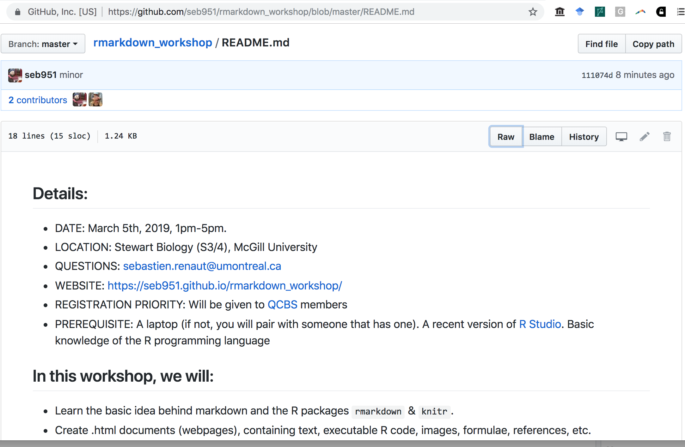
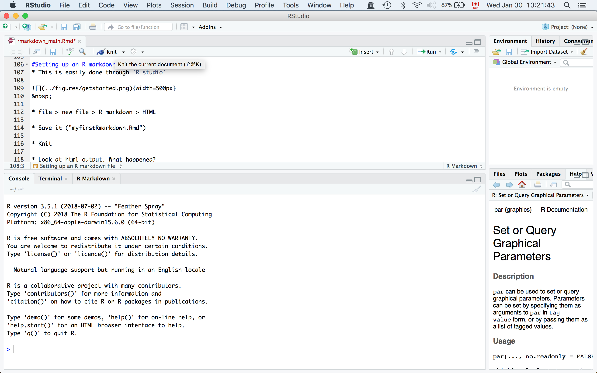

```{r setup, include=FALSE}
knitr::opts_chunk$set(echo = TRUE)
```

#Introduction  
* You can download the workshop material here (https://github.com/seb951/rmarkdown_workshop).  

{width=500px}  
&nbsp;  
* Follow the *.html* and the *.Rmd* documents. Try and experiment.  

* ~2 hours: Introduction and practice      

* ~15 minutes: pause  

* ~1 hour: other formats (*.docx*, *.pdf*)  

* ~15 minutes: shiny   

#Markdown
* Markdown is a **lightweight markup language** with plain text formatting syntax (Easy-to-read, easy-to-write plain text format). It is designed so that it can be converted to HTML and many other formats (e.g. PDF, MS Word, .docx).  

* Like other markup languages (e.g. HTML and Latex), it is completely independent from R.  

* Typically have the file extension *.md*.    

* Look at this [example](https://github.com/seb951/rmarkdown_workshop/blob/master/README.md). Examine the github render and raw file.     
{width=500px}

#R Markdown
* An extension of the markdown syntax that enables **R code to be embedded and executed**.  

* To generate **fully reproducible reports** in different of static and dynamic output formats.  

* Most of these packages are maintained by the Rstudio team  (https://rmarkdown.rstudio.com/, Yihui Xie)    

* Plain text files that typically have the file extension *.Rmd*.  

* How does it work: 
    + The R package `rmarkdown` feeds the *.Rmd* file to the R package `knitr`.   

    + `knitr` executes code and creates a new markdown (*.md*) document which includes the code and output.  

    + Subsequently tranformed into *.html*/*.tex*/*.docx* by [`pandoc`](https://pandoc.org/). Note that *.tex* files need to be transformed by `pdflatex` into *.pdf* files. (We'll come back to that later.)  

    + `Pandoc` is an universal document converter, not an R package.

    + `rmarkdown`, `knitr`, and `pandoc` are built in `Rstudio`. `pdflatex` is not.  

    + When you click the **Knit** button (top left), a document will be generated that includes both content as well as the output of  `R` code within the document.  
{width=500px}

#R markdown syntax
* Markdown provides an easy way to make standard types of formatted text, like:    

    + Two spaces for a newline character   

    + *italics* (\*text\*) or _italics_ (\_text\_)  

    + **bold**  

    + backslash (\\) to interpret a special characters as character  

    + \# at the beginning of line for a header level (6 levels)

    + _**bold italic**_  

    + `code`    

    + [links](https://www.rmarkdown.rstudio.com)  

    + "\&nbsp;  " character (html *N*on-*B*reaking *SP*ace) for extra line spacing is useful.  
  
    + list
        + item 1a
        + item 1b
     
> Quoted text   
> more quoted text     
> still more quoted text     

Species | Counts
--------- | -----
*H. sapiens* | 24
*M. musculus* | 442    

* The [cheatsheet](https://www.rstudio.com/wp-content/uploads/2015/02/rmarkdown-cheatsheet.pdf) is your friend.  

#Setting up an R markdown file  
* This is easily done through `R studio`  
   
{width=500px}  
&nbsp;      
  
* file > new file > R markdown > HTML   

* Save it ("myfirstRmarkdown.Rmd")   

* Knit

{width=500px}  
&nbsp; 

* Examine the *.html* output.   

* Examine at the *.Rmd* file structure.   

##Exercice 1  (10min.)
* Delete all of the R code chunks and write a some Markdown (some sections, some italicized text, some URLs, and an itemized list). Convert the document to a webpage.  


#Header
>---  
>title: "Rmarkdown"  
>author: "Sebastien Renaut"  
>date: '2018-03-12'  
>output: html_document  
>---  

* Header, metadata, YAML, YAML Ain't Markup Language (https://en.wikipedia.org/wiki/YAML#History_and_name) ?  

* It specifies configurations (what kind of document will be created, and the options chosen).   

* It is not required (defaults then apply).  

* It uses `Python`-style indentation to specify certain options.  

* Many options possible depending what type of document you are generating. See below for some examples.  

* Note that some options can be specified either for the whole document (in the YAML header), the code chunks, or both (chunks options supersede YAML header). More on code chunks later.  

#Customizing header
>---  
>title: "Rmarkdown"  
>author: "Sebastien Renaut"  
>date: "`r format(Sys.time(), '%B %d, %Y')`"   
>#date: "Jan 30th, 2019`"  
>output:  
> html_document:  
>   highlight: tango  
>   number_sections: T  
>   theme: united 
>   toc: yes  
>   toc_depth: 3  
>---
  
* Note the indentation in the **.Rmd** document for the *html_document* options.
* Note that date is population via an `R` function
* Note the **#** symbol to comment out.   
  
##Outputs 
See the [documentation](https://rmarkdown.rstudio.com/lesson-9.html) for more information. But these are some formats of interest.  

* `html_document`   

* `ioslides_presentation`  

* `pdf_document` (This will require that you have a [Latex software](https://www.latex-project.org/get/) installed - We'll get to that later).    

* `word_document` (*.docx*)   

* interactive `shiny` apps.  

##Table of content
* `toc: yes` Generate TOC.   

* `toc_depth:3` depth of TOC.    

* `number_sections:T` Add section numbering to headers.  

* More options [here](https://bookdown.org/yihui/rmarkdown/html-document.html#table-of-contents)
    
##Theme, highlight & other options
* `theme: ` specifies the theme to use for the page  ("cerulean", "journal", "flatly", "readable", "spacelab", "united", and "cosmo").  
* `highlight: ` Syntax highlighting style (e.g. "tango", "pygments", "kate", "zenburn").  

* See this [Reference guide](https://www.rstudio.com/wp-content/uploads/2015/03/rmarkdown-reference.pdf) for more options. 

##Exercice 2  (10min.)
* Change theme of your `Rmarkdown` document  
* Save it as a word document  
* Change highlighting  
* Add TOC  
* Save, knitr and play with options.  

#Code chunks
* The real power of `R Markdown` comes from mixing markdown with chunks of code.    

*The main code chunks may look like this:  

>\```{r code chunk example, include = T, message = T, warning=T, echo = T, fig.cap="Figure 1"}  
>#Running some R code.
>x = rexp(1000)  
>min(x)  
>max(x)  
>plot(x)  
>\```  
  
* On the 1st line, I specify that I will run the `R` programming language. Then I give the chunk a **unique** name. Then I specify options. Here are common options:  
    + `include = FALSE` prevents code and results from appearing in the finished file. R Markdown still runs the code in the chunk, and the results can be used by other chunks.    
  
    + `echo = FALSE` prevents code, but not the results from appearing in the finished file. This is a useful way to embed figures.  
  
    + `message = FALSE` prevents messages that are generated by code from appearing in the finished file.    
  
    + `warning = FALSE` prevents warnings that are generated by code from appearing in the finished file.    
  
    + `fig.cap = "..."` adds a caption to graphical results.    
  
    + `fig.width=...`, `fig.height=...` can also change figure width/heigth.    

* By default `R studio` creates this code chunk (remember that `knitr` executes code and creates a new markdown (*.md*) document which includes the code and output). Let's examine this chunk:    

>\```{r setup, include=FALSE}  
>knitr::opts_chunk$set(echo = TRUE)  
>\```  

* see [cheat sheet](https://www.rstudio.com/wp-content/uploads/2015/02/rmarkdown-cheatsheet.pdf) for more info.   

* Note that you also run inline code using the using the \`   \` symbols and specifying the programming language `r`: 10+5=`r 10+5`

##Exercice 3 (15 min.)
* Add a code chunks that will:
    + load an R package and make a plot  
    + load an R package and print some output of a function     
* Run inline code.  
* Can you find options to print code, but not run it.   
* Also, try clicking the green arrow in the *.Rmd* on the right to execute a code chunk a preview its output. 

##More Code chunks
* R markdown can read and execute different languages!
**bash**
```{bash}
ls -1
```

**python**
```{python}
x = "hello python"
print(x.split(' '))
```

**perl**
```{perl}
print "Hello World!";
```

##Math symbols
* Mathematical material is set off by the use of single dollar-sign characters (similar as in the LaTeX typesetting language).  

* So to write, $E = mc^{2}$ in markdown you'd write:  **\$E = mc^{2}\$**   

* $\sum_{i=1}^n ASV$    

* $F_{(1,69)}$ =   1.27, *p*-value=0.26   

* $A = \pi*r^{2}$

* $\sqrt{b^2 - 4ac}$

* If you wish to use a dollar sign, you need to preface it with a back-slash $E = mc^{2}$ versus \$E = mc^{2}\$  
  
* The use of double dollars quote allows for displayed formulas (centered). $$\sqrt{b^2 - 4ac}$$  

* See [more](http://www.math.mcgill.ca/yyang/regression/RMarkdown/example.html) example equations from an McGill math Rmarkdown tutorial.  

#Include pictures & figures.
* There are several ways to include figures.   

* Can be included from a URL directly uploaded from the web:  
`{width=250px}`  
   
{width=250px}  
&nbsp;   
&nbsp;  
&nbsp;   

* This is a graph previously saved in the *figures* directory   
`{width=250px}`   
{width=250px}
&nbsp;  

* In both these cases, graphs are rendered with `pandoc` and not `knitr`, so pandoc options need to be specified, not R graphics options:  
    + It's simple, but options are tricky.  

    + You may need to play with spacing, figure size, and figure position.  

    + Options are specified directly after the URL or link to image with (eg. {width=250px} or eg. {width=50%}). Check the *.Rmd* file

* Images can also be interpreted directly by `knitr` as below:  
  
>\```{r graphic_example, out.width = "20%", fig.cap = "A random orange man", echo = F}  
>knitr::include_graphics("../figures/orange.jpeg")  
>\```
  
```{r graphic_example, out.width = "20%", fig.cap = "A random orange man", echo = F}
knitr::include_graphics("../figures/orange.jpeg")
```

* Graphs can also be generated directly by R code, specified in a code chunk (R options specified in the code chunk) and interpreted by `knitr` as we did previously.  

>\```{r another example, echo = F}  
>x = rnorm(1000,5,2)  
>hist(x)  
>\```

```{r another example, echo = F}
x = rnorm(1000,5,2)  
hist(x)
```

#Including Tables
* By default, R Markdown displays data frames and matrices as they would be in the R terminal (in a monospaced font). It is not very pretty.   

* If you prefer that data be displayed with additional formatting you can use the `knitr::kable` function, as in the *.Rmd* file below.  

>\```{r table, echo=T}    
>\#Default R printout (ugly)    
>print(head(mtcars))    
  
>\#kable from knitr (better looking)      
>knitr::kable(head(mtcars),digits =1,caption = "An motorcars table")  
>\```     


```{r table, echo=T}
#default R printout (ugly)
print(head(mtcars))

#kable from knitr (better looking)
knitr::kable(head(mtcars),digits =1,caption = "A motorcars table")
```

##Exercice 4 (10 min.)
* Find a picture on the web.     

* Add it to document using either `knitr` or `pandoc`  

* Add a table using `knitr`  

#Citations, footnotes, bibliography
* Footnotes are easy when you have a few references [^1]  

* Otherwise, you may specify a bibliography and citation style in the header.  

`...`  
`csl: csl/peerj.csl`  
`bibliography: biblio/test_library.bib`  
`---`
 
* The Citation Style Language (*.csl*) file specifies the reference format.   

* It is an open XML-based language to describe the formatting of citations and bibliographies. Reference management programs using *.csl* include Zotero, Mendeley and Papers.  

* Here I just googled, downloaded and used the *.csl* file for PeerJ.  

* Most journals should be on this [github repo](https://github.com/citation-style-language/styles). But you could create your own.  

* A *.bib* file will contains the bibliographic information of our document. Here: a *.bib* file was created in the reference management software [Papers3](https://www.readcube.com/papers/mac).  
  
##Citations: examples  
* Example: The bioinformatics program *BLAST* [@altschul1997gapped] has been cited nearly 70,000 times!  

* These are three random references [eg. @ThibertPlante:2010vw;@Wagner:2012hw;@Yoshida:2014bn].  
  
* Citations go inside square brackets and are separated by semicolons. Each citation must have a key, composed of ‘@’ + the citation identifier from the database.  

* A minus sign (-) before the @ will suppress mention of the author in the citation. This can be useful when the author is already mentioned in the text. For example, Altschul *et al.* [-@altschul1997gapped] has 70,000 citations. 

##Exercice 5 (10min.)
* Create a library (`.bib` file) with the references for your five favorite scientific papers.

* Find and use another Citation Style Language (e.g. Nature, Science, PLOS ONE, etc.). 

#Cheatsheets and help
* Lessons: https://rmarkdown.rstudio.com/lesson-1.html  

* Book: https://bookdown.org/yihui/rmarkdown/  

* Cheatsheet (old - short): https://www.rstudio.com/wp-content/uploads/2015/02/rmarkdown-cheatsheet.pdf

* Cheatsheet (newer - longer): https://www.rstudio.com/wp-content/uploads/2016/03/rmarkdown-cheatsheet-2.0.pdf

* stackoverflow: https://stackoverflow.com/


#References
* Note that references below are generated automatically, except for the footnote.  

[^1]: Renaut 2018. footnote number 1. pp1-2
