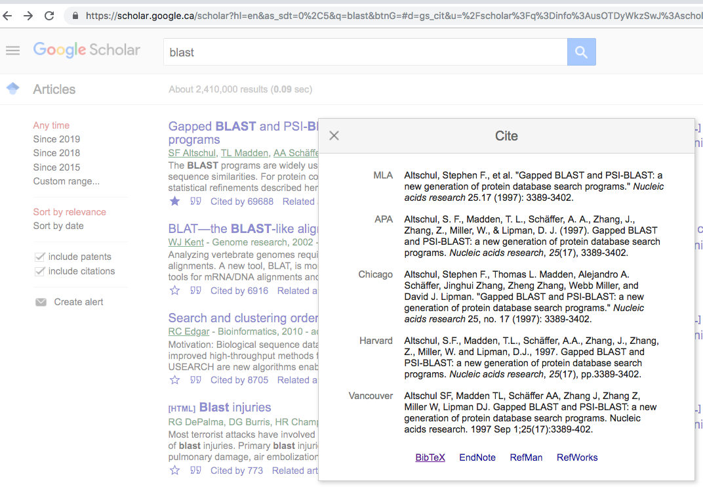

---
title: "R markdown"
author: "Sébastien Renaut"
date: "`r format(Sys.time(), '%B %d, %Y')`"
output: 
  html_document:
    highlight: tango
    number_sections: T
    theme: cerulean
    toc: yes
    toc_depth: 2
    toc_float:
      collapsed: T
csl: ../csl/peerj.csl
bibliography: ../biblio/test_library.bib
---  

```{r setup, include=FALSE}
knitr::opts_chunk$set(echo = TRUE)
```

# Pre-requisite {.unnumbered}

## Software {.unnumbered}
+ The latest version of R installed ([R version 3.5.2](https://cran.rstudio.com/)).

+ [{width=48px} v.1.1](https://www.rstudio.com/products/rstudio/download/#download) or better, [Rstudio v.1.2](https://www.rstudio.com/products/rstudio/download/preview/) (Note that this version is not officially released yet).

+ These packages need to be installed / updated.  
```prereq
install.packages("knitr")
install.packages("rmarkdown")
install.packages("rticles")  
install.packages("tinytex")
tinytex::install_tinytex()  #Please run this command as well to install a LaTeX distribution. This may take a few minutes to install (~150MB).
```

+ Usefull trick: In Tools -> Global Options -> Code -> Display, check "Show whitespace characters". This will let you see spaces and newlines in the editor.

## Course material {.unnumbered} 
+ Follow workshop here: https://seb951.github.io/rmarkdown_workshop/Rmarkdown/rmarkdown_main.html

+ Download the workshop material on [GitHub](https://github.com/seb951/rmarkdown_workshop) {width=34px}. Unzip and double-click on *Rmarkdown.Proj* file.

{width=500px}  
&nbsp;  

+ Don't hesitate to comment (new issues), or request changes (pull request).   

+ Follow the *.html* (web browser) and the *.Rmd* (R studio) documents. Try and experiment.

+ ~2 hours: Introduction and practice      

+ ~10 minutes pause  

+ ~1 hour: other formats ([*.docx*, *.pdf*](https://seb951.github.io/rmarkdown_workshop/Rmarkdown/rmarkdown_word_pdf.html) and [*Shiny*](https://sebastien.shinyapps.io/shiny/)).

# Introduction
Let's look at a few examples on the Rstudio [gallery](https://rmarkdown.rstudio.com/gallery.html) 

# Markdown
+ Markdown is a **lightweight markup language** with plain text formatting syntax (Easy-to-read, easy-to-write plain text format). It is designed so that it can be easily converted to HTML and many other formats (e.g. PDF, MS Word, .docx).  

+ Like other markup languages (e.g. HTML and Latex), it is completely independent from R.  

+ Typically, file have the extension *.md*.    

+ Look at this [example](https://github.com/seb951/rmarkdown_workshop/blob/master/README.md). Examine the html render (GitHub automatically interprets *.md* files) and raw file.     
{width=500px}

# R Markdown
+ An extension of the markdown syntax that enables **R code to be embedded and executed**.  

+ Generate **fully reproducible reports** in different static and dynamic output formats.  

+ Most of these packages are maintained by the R studio team  (https://rmarkdown.rstudio.com/, {width=20px} [Yihui Xie](https://yihui.name/))    

+ Plain text files that typically have the file extension *.Rmd*.  

# R Markdown basics
+ Write text & code in R studio.

{width=500px}

+ Knit: The R package `rmarkdown` feeds the *.Rmd* file to the R package `knitr`.   

+ `knitr` executes code and creates a new markdown (*.md*) document which includes the code and output.  

+ Subsequently tranformed into *.html*/*.tex*/*.docx* by `pandoc`. (Note that *.tex* files need to be transformed by `pdflatex` into *.pdf* files. We'll come back to that later.)  

+ [`Pandoc`](https://pandoc.org/) is an universal document converter, independent of `R`.

+ By default, R studio comes with `rmarkdown`, `knitr`, and `pandoc` (but not `pdflatex`).  

+ When you click the **Knit** button (top left), a document will be generated that includes both content as well as the output of `R` code within the document. You can also use the `render()` function.

{width=500px}  

## Exercice 1: Setting up an R markdown file
+ This is easily done through R studio.  
   
{width=500px}  
&nbsp;      
  
+ file > new file > R markdown > HTML   

+ Save it ("myfirstRmarkdown.Rmd")   

+ Knit

+ Examine the *.html* output.   

+ Examine at the *.Rmd* file structure.   

# R markdown syntax
Markdown provides an easy way to make standard types of formatted text, like:

+ *italics* (\*text\*) or _italics_ (\_text\_)  

+ **bold**  (\*\*bold\*\*)

+ backslash (\\) to interpret a special characters as character  

+ "\# and space" at the beginning of line for a header level (6 levels, \# to \#\#\#\#\#\#)

+ _**bold italic**_ (\_\*\*bold italic\*\*\_) 

+ [links](https://www.rmarkdown.rstudio.com)  (`[links](https://www.rmarkdown.rstudio.com)`)

+ <!--comments--> (\<!--comments-->)

+ newline character: Two spaces and the end of line

+ paragraph mark: Two cariage returns

+ list (first level using: **\* or \+ and space**)
  + item 1 (second level using:  **space, space, \* or \+, and space**)
  + item 2
    + subitem 1a  
    + subitem 1b
      + subsubitem 1b
  + item 3      
  
+ \*\*\* for an horizontal line
    
+ `quoted text` (\`quoted text\`)  
    
***
    
\> Quoted text: 1st way       
\> more quoted text       
\> still more quoted text   
  
> Quoted text: 1st way      
> more quoted text       
> still more quoted text        
  
***
    
\`Quoted text: 2nd way\`       
\`more quoted text\`         
\`still more quoted text\`     
  
`Quoted text: 2nd way`     
`more quoted text`       
`still more quoted text`       
    
***
    
\```  
\Quoted text: 3rd way     
\more quoted text         
\still more quoted text       
\```   

```  
Quoted text: 3rd way    
more quoted text         
still more quoted text        
```

***

+ Tables  

>Species \| Counts  
>--------- \| -----  
>*H. sapiens* \| 24  
>*M. musculus* \| 442   

Species | Counts
--------- | -----
*H. sapiens* | 24
*M. musculus* | 442    

+ The [cheatsheet](https://github.com/rstudio/cheatsheets/raw/master/rmarkdown-2.0.pdf) is your friend.  


## Exercice 2  
+ Write some text now (add italicized/bold text, some URLs, and an itemized list, have fun!).

+ You can use this wikipedia text and list of [roses subgenera](https://en.wikipedia.org/wiki/List_of_Rosa_species#Subgenera_and_sections) as an example to reproduce.  
{width=800px}


+ Convert the document to a html webpage.  

# Header
```header
---  
title: "Rmarkdown"  
author: "Sebastien Renaut"  
date: '2018-03-12'  
output: html_document  
---  
```  

+ Header, metadata, YAML, YAML Ain't Markup Language (https://en.wikipedia.org/wiki/YAML#History_and_name) ?  

+ Header specifies configurations (what kind of document will be created, and the options chosen).   

+ It is not required (defaults then apply).  

+ It uses `Python`-style indentation to specify some options.  

+ [Many options possible](https://github.com/rstudio/cheatsheets/raw/master/rmarkdown-2.0.pdf) depending what type of document you are generating. See below for some examples.  

+ Note that some options can be specified either for the whole document (in the header), the code chunks, or both (chunks options supersede header). More on code chunks later.  

## Customizing header
```custom 
---  
title: "Rmarkdown"  
author: "Sebastien Renaut"  
date: "`r format(Sys.time(), '%B %d, %Y')`"   
output: 
 html_document:  
   highlight: tango  
   number_sections: T  
   theme: cerulean 
   toc: yes  
   toc_depth: 3  
---  
```  
  
+ Note the indentation in the *.Rmd* document for the *output* options.  
    
+ Note that date is populated via an `R` function.    

## Outputs 
See the [official R markdown lessons](https://rmarkdown.rstudio.com/lesson-9.html) for more information. But these are some formats of interest:  

+ `output: html_document`   

+ `output: ioslides_presentation`  

+ `output: pdf_document` (This will require that you have a [Latex software](https://www.latex-project.org/get/) installed - We'll get to that later).    

+ `output: word_document` (*.docx*)   

+ interactive `shiny` apps (We'll get to that later as well). 

## Table of content
+ `toc: yes` Generate Table of Content.   

+ `toc_depth:3` depth of TOC.    

+ `number_sections:T` Add section numbering to headers. Note that if you do not want a certain heading to be numbered, you can add `{-}` or `{.unnumbered}` after the heading, e.g.,

```markdown
# Preface {-}
```

+ More options in [official R markdown book](https://bookdown.org/yihui/rmarkdown/html-document.html#table-of-contents)
    
## Theme, highlight & other options
+ `theme: ` specifies the theme to use for the page  ("cerulean", "journal", "flatly", "readable", "spacelab", "united", and "cosmo").  
  
+ `highlight: ` Code syntax highlighting style (e.g. "tango", "pygments", "kate", "zenburn").  

+ See the [cheatsheet](https://github.com/rstudio/cheatsheets/raw/master/rmarkdown-2.0.pdf) and [official R markdown book](https://bookdown.org/yihui/rmarkdown/html-document.html#appearance-and-style) for more options. 

## Exercice 3
+ Change theme of your `Rmarkdown` document    

+ Change highlighting      

+ Add Table of Content    

+ Change output (eg.: `output: word_document`)    

+ Save, knit and play with options.     

# Code chunks
+ The real power of `R Markdown` comes from mixing markdown syntax with chunks of code.    

+ A code chunk is intepreted by `knitr`. It works essentially the same as the `R` syntax we are familiar with.  
  
+ A main code chunks may look like this:  

 <!--An ugly Rmarkdown hack below to show the code chunk 'as is'-->
````chunks 
`r ''````{r example, include = T, message = T, warning=T, echo = F, fig.cap="A figure of random points"}  
#Running some R code.
x = rexp(1000)  
min(x)  
max(x)  
hist(x)  
```    
````

```{r example, include = T, message = T, warning=T, echo = F, fig.cap="A figure of random points"}  
#Running some R code.
x = rexp(1000)  
min(x)  
max(x)  
hist(x)  
```
``` ```
     
+ On the 1st line, I specify that I will run the `R` programming language.  

+ Then, I give the chunk a **UNIQUE** name and specify options.   

+ There are a large number of chunk options in `knitr` documented [here](https://yihui.name/knitr/options/).  

+ Here are common options:  
  + `include = FALSE`: Code and results will NOT appear in the finished file. Code is still interpreted, and the results can be used by other chunks.    
  
  + `echo = F` prevents code, but not results from appearing in the finished file. This is a useful way to embed figures.  
  
  + `message = F` prevents messages that are generated by code from appearing in the finished file.    
  
  + `warning = F` prevents warnings that are generated by code from appearing in the finished file.    
  
  + `fig.cap = "..."` adds a caption to graphical results.    
  
  + `fig.width=...`, `fig.height=...` can also change figure width/heigth.    

+ By default R studio creates a *Global Options* code chunk. Let's examine this chunk:    

````global  
`r ''````{r setup, include=FALSE}  
knitr::opts_chunk$set(echo = TRUE)  
```  
````
``` ```

+ see [cheat sheet](https://github.com/rstudio/cheatsheets/raw/master/rmarkdown-2.0.pdf) for more info.   

+ Note that you can also run inline code. For example, \` r 10+5 \` would be processes as `r 10+5`.

## Exercice 4
+ Add a code chunks that will:
  + load an R package and make a plot  
  + load an R package and print some output of a function

+ Run inline code.  

+ Can you find options to print code, but not run it?   

+ Also, try clicking the green arrow in the *.Rmd* on the right to execute a code chunk and preview its output. 

## More on code chunks
R markdown can read and execute different languages!    
````bash  
`r ''````{bash, echo = F}
ls -1 | head -3
```
````

```{bash, echo = F}
ls -1 | head -3
```
``` ```

````python  
`r ''````{python, echo = F}
x = "hello python!"
print(x.split(' '))
```
````

```{python, echo = F}
x = "hello python!"
print(x.split(' '))
```
``` ```

````perl  
`r ''````{perl, echo = F}
print "Hello perl!";
```
````

```{perl, echo = F}
print "Hello perl!";
```
``` ```

# Math symbols
Mathematical material is set off by the use of single dollar-sign characters (similar as in the LaTeX typesetting language).  

+ So to write $E = mc^{2}$, you'd write:  **\$E = mc^{2}\$**   

+ $\sum_{i=1}^n ASV$    

+ $F_{(1,69)}$ =   1.27, *p*-value=0.26   

+ $A = \pi*r^{2}$

+ $\sqrt{b^2 - 4ac}$

+ If you need to use an actual dollar sign, you need to preface it with a back-slash $E = mc^{2}$ versus \$E = mc^{2}\$  
  
+ The use of double dollars quote allows for displayed formulas (centered). $$\sqrt{b^2 - 4ac}$$  

+ See [more](http://www.math.mcgill.ca/yyang/regression/RMarkdown/example.html) example equations from this McGill math R markdown tutorial.  

# Include pictures & figures
There are several ways to include figures.   

### URL {.unnumbered}
Can be included from an URL directly uploaded from the web:  
`{width=250px}`  
   
{width=250px}  
&nbsp;   

### Inline figure {.unnumbered}
If this figure is small, it can be added to the text directly: eg.: Today, we are using  {width=44px} to generate webpages with {width=30px} images...

### Previously saved {.unnumbered}
This is an image previously saved in the *figures* directory   
`{width=250px}`   
{width=250px}
&nbsp;  

In all these cases, graphs are rendered with `pandoc` and not `knitr`, so pandoc options need to be specified, not `knitr` R graphics options:

+ It's simple, but options can be tricky.  

+ You may need to play with spacing, figure size, and figure position.  

+ Options are specified directly after the URL or link (eg. {width=250px} or {width=50%}).  

### knitr {.unnumbered}
Images can also be interpreted by `knitr` as below:  

````global  
`r ''````{r graphic_example, out.width = "20%", fig.cap = "rosa_banksiae", echo = F,fig.align = "center"}  
  
```
````

```{r graphic_example, out.width = "20%", fig.cap = "rosa_banksiae.JPG", echo = F,fig.align = "center"}

```
``` ```

### Wrapping text {.unnumbered}
````global  
`r ''````{r roses, out.width = "50%",echo = F,out.extra='style="float:right; padding:10px"'}
  
```
````

```{r roses, out.width = "40%",echo = F,out.extra='style="float:right; padding:10px"'}

```
``` ```

#### Subgenera and sections {.unnumbered}
The genus Rosa is subdivided into four subgenera:

+ _**Hulthemia**_ (formerly Simplicifoliae, meaning "with single leaves") containing one or two species from southwest Asia, R. persica and R.berberifolia (syn. R. persica var. berberifolia) which are the only roses without compound leaves or stipules.
+ _**Hesperrhodos**_ (from the Greek for "western rose") has two species, both from southwestern North America. These are R. minutifolia and R. stellata.
+ _**Platyrhodon**_ (from the Greek for "flaky rose", referring to flaky bark) with one species from east Asia, R. roxburghii.
+ _**Rosa**_ (the type subgenus) containing    
&nbsp;
&nbsp;
&nbsp;


### R generated {.unnumbered}
Graphs can also be generated directly by `R` code, specified in a code chunk (`R` options specified in the code chunk) and interpreted by `knitr` as we did previously.  
 
````ggplot  
`r ''````{r another example, echo = F, message = F}
library(ggplot2)
mtcars_ggplot = ggplot(mtcars, aes(x=wt, y=mpg)) + 
geom_point() + geom_smooth()
mtcars_ggplot
```
````

```{r another example, echo = F, message = F}
library(ggplot2)
mtcars_ggplot = ggplot(mtcars, aes(x=wt, y=mpg)) + 
geom_point() + geom_smooth()
mtcars_ggplot
```
``` ```

### Two figures in two columns {.unnumbered}

````2figs  
`r ''````{r out.width=c('50%', '50%'), fig.show='hold',echo=F,message = F}
mtcars_ggplot
plot(rnorm(10))
```
````

```{r out.width=c('50%', '50%'), fig.show='hold',echo=F}
mtcars_ggplot
plot(rnorm(10))
```   
``` ```

# Including Tables
+ By default, R Markdown displays data frames and matrices as they would be in the R terminal. {width=39px}   

+ You can use the `knitr::kable` function for additional formatting, as in the *.Rmd* file below.  

```{r table, echo=T}
#Default R printout (ugly)
print(head(mtcars))

#With kable function from knitr (better looking)
knitr::kable(head(mtcars),digits =1,caption = "A motorcars table")
```

## Exercice 5
+ Find a picture on the web. Save it.     

+ Add it to document either directly, or through a code chunk.

+ Try adjusting size.

+ Add a table using `knitr`.

# References

## Footnotes

+ Footnotes are easy when you have a few references[^1]. Use `[^1]` in text, and add reference at the end using this format: `[^1]: Renaut 2019. R markdown footnote. Number 1. pp1-2.`    

## Bibliography
+ Otherwise, you may specify a bibliography and citation style by adding these two lines in the header.  

```citations
csl: ../csl/peerj.csl  
bibliography: ../biblio/test_library.bib  
```

+ Note that you may need to specify the file path or add them to the current directory.  


### Citation Style Language (*.csl*)
* The Citation Style Language (*.csl*) file specifies the reference format.     
  
* It is an open XML-based language that describe the formatting of citations and bibliographies. Reference management programs using *.csl* include [Zotero](https://www.zotero.org/), [Mendeley](https://www.mendeley.com/?interaction_required=true) and [Papers3](https://www.readcube.com/papers/mac).     
  
* Most journals should have a *.csl* file be on this [GitHub repo](https://github.com/citation-style-language/styles). But you could also create your own.  

### Bibliographic information (*.bib*)
* A *.bib* file contains the bibliographic information of your document in *bibTeX* format. 

````bibfile
@article{altschul1997gapped,
  title={Gapped BLAST and PSI-BLAST: a new generation of protein database search programs},
  author={Altschul, Stephen F and Madden, Thomas L and Sch{\"a}ffer, Alejandro A and Zhang, Jinghui and Zhang, Zheng and Miller, Webb and Lipman, David J},
  journal={Nucleic acids research},
  volume={25},
  number={17},
  pages={3389--3402},
  year={1997},
  publisher={Oxford University Press}
}
````

* Here, I created a *.bib* file (*../biblio/test_library.bib*) in the reference management software [Papers3](https://www.readcube.com/papers/mac). 
 
* I often copy *.bib* references directly from Google Scholar and add it to a *.bib* database text file.   

{width=500px}


## Citations  
The bioinformatics program *BLAST* [@altschul1997gapped] has been cited nearly 70,000 times. These are three random references [@ThibertPlante:2010vw;@Wagner:2012hw;@Yoshida:2014bn] from my database.  
  
* Citations go inside square brackets [  ] and are separated by semicolons (;). 

* Each citation must have a unique key, composed of ‘@’ + the citation identifier from the *.bib* database file.  

* A minus sign (-) before the @ will suppress mention of the author in the citation. This can be useful when the author is already mentioned in the text. For example, *The BLAST algorithm by Stephen Altschul and a bunch of other people [-@altschul1997gapped] have been cited 70,000 times.* 

## Exercice 6
* Find 3 papers in Google Scholar. Copy *bibTeX* references to a text file. Save it with a *.bib* extension.

* Find, save as text file (*.csl* extension) and use another Citation Style Language from this [GitHub repo](https://github.com/citation-style-language/styles) (e.g. Nature, PLOS ONE, Indian Journal Of Dermatology, etc.). (hint: type 't' in GitHub repo to activate search function). 

# Cheatsheets and help
* [Lessons](https://rmarkdown.rstudio.com/lesson-1.html)  

* [Book](https://bookdown.org/yihui/rmarkdown/)   
  * This is a great reference. In addition, it is (of course) written in `R markdown` and publicly available on [GitHub]( https://github.com/rstudio/rmarkdown-book). As such, if you see something you want to reproduce, go see how it was written in the *.Rmd* version!  
  
* [Cheatsheet (newer - longer)](https://github.com/rstudio/cheatsheets/raw/master/rmarkdown-2.0.pdf)

* [Pimp my Rmd](https://holtzy.github.io/Pimp-my-rmd/)

* [Stack Overflow](https://stackoverflow.com/)


# References
(Note that references below are generated automatically, except for the footnote.)  

[^1]: Renaut 2019. R markdown footnote. Number 1. pp1-2
