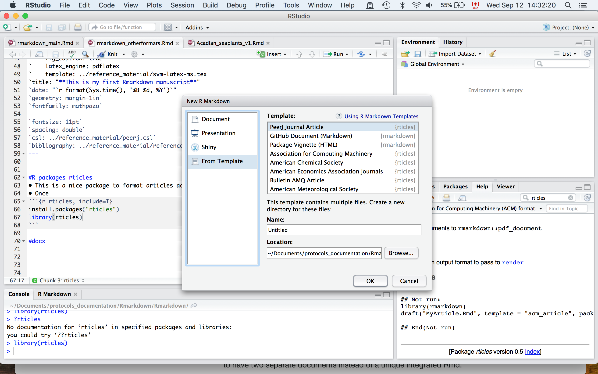

```{r setup, include=FALSE}
knitr::opts_chunk$set(echo = TRUE)
```

#Word documents
• You can specify it when you create a new Rmarkdown document
• You can also specify it later in the YAML  
`---`  
`title: "rmarkdown_pdf_docx"`  
`author: "Sebastien Renaut"`  
`date: '2018-09-06'`  
`output: word_document`  
`---`    
• Then, it's just a matter of kniting the document!      

#pdf document
• You need a extra step to go from a Latex (.tex) file to a .pdf.
• [Latex software](https://www.latex-project.org is a high-quality typesetting system; It is the *de facto* standard for the communication and publication of scientific documents. LaTeX is available as free software.
{width=500px}

• [Latex software](https://www.latex-project.org/get/) is available here.  
• `tinytex` R package is a wrapper function that installs `TinyTeX`. `TinyTex` is a custom LaTeX distribution based on TeX Live that is small in size but functions well in most cases, especially for R users (https://yihui.name/tinytex/r/).   
• But first, go install it in the R console `install.packages("tinytex")`    
```{r tinytex, include=T}
library(tinytex)
#tinytex::install_tinytex()
```

#Basic yaml setup for pdf  
`---`  
`title: "rmarkdown_pdf_docx"`  
`author: "Sebastien Renaut"`  
`date: '2018-09-06'`  
`output: pdf_document`  
`---`  

#More complex yaml setup for .pdf files
`---`  
`output:`   
`  pdf_document:`  
`    keep_tex: true`  
`    fig_caption: true`  
`    latex_engine: pdflatex`  
`title: "**This is my first Rmarkdown manuscript**"`  
`date: "`r format(Sys.time(), '%B %d, %Y')`"`  
`geometry: margin=1in`  
`fontfamily: mathpazo`  
`fontsize: 11pt`  
`spacing: double`  
`csl: ../reference_material/peerj.csl`  
`bibliography: ../reference_material/reference.bib`  
`---`    
• Note the indentation  
• Note the bibliography file for references + .csl file for formatting references.

#R packages rticles
• This is a nice package to format articles according to the specification of a journal
• But first, go install it in the R console `install.packages("rticles")`
```{r rticles, include=T}
library(rticles)
```
• Once installed, try starting a new R markdown according to your journal of interest.
{width=500px}
{width=500px}


#.tex template  
• You can build your own if you know Latex...     
• There are many templates available on the web that you can use.  
• Here is one I like for [manuscripts](https://github.com/svmiller/svm-r-markdown-templates/blob/master/svm-latex-ms.tex):  
• Here is one I like for [CVs](https://github.com/svmiller/svm-r-markdown-templates/blob/master/svm-latex-cv.tex):  
• Simply add it to the YAML header like this: `template: ../reference_material/svm-latex-ms.tex`   
`---`  
`output:`  
`  pdf_document:`  
`   keep_tex: true`  
`   fig_caption: true`  
`   latex_engine: pdflatex`  
`   template: ../reference_material/svm-latex-ms.tex`        
`title: "**This is my first Rmarkdown manuscript**`  

#Overleaf 
• Overleaf is an online LaTeX and Rich Text collaborative writing and publishing tool that makes the whole process of writing, editing and publishing scientific documents much quicker and easier.  
{width=500px}
  
• Remember this:  
{width=500px}
  
• [A tutorial on how to interface an R Notebook with Overleaf](https://medium.com/@arinbasu/a-tutorial-on-how-to-interface-an-r-notebook-with-overleaf-11f23c306cfd)

• You can generate your .tex file, upload it to a github repo and overleaf will connect to it. Others can then collaborate and modify the .tex file   


#slide presentation  

# Radix
https://blog.rstudio.com/2018/09/19/radix-for-r-markdown/
