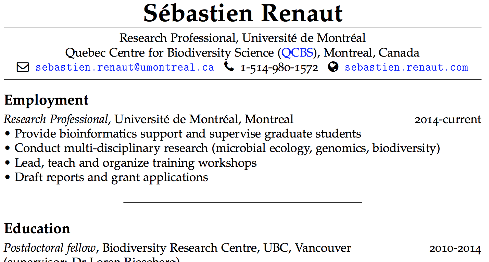

---    
title: "rmarkdown_pdf"    
author: "Sébastien Renaut"    
date: '2018-09-06'    
output: 
  html_document: 
    toc: yes  
--- 

```{r setup, include=FALSE}
knitr::opts_chunk$set(echo = TRUE)
```

# Different outputs
* There are six versions of this document:
  + *.Rmd*: The `Rmarkdown` document. 
  + *.html*: A Webpage as we saw in the previous section. Follow using this version. 
  + *rmarkdown_word_pdf2.html*: A `radix` webpage. 
  + *.docx*: A MS Word document.
  + *.tex*: A [LaTeX](https://www.latex-project.org) document.
  + *.pdf*: A PDF document.

## html document
```html
---    
title: "rmarkdown_pdf"    
author: "Sébastien Renaut"    
date: '2018-09-06'    
output: 
  html_document: 
    toc: yes  
--- 
```
  
## Microsoft Word  
```word
---  
title: "rmarkdown_docx"  
author: "Sébastien Renaut"  
date: '2018-09-06'  
output: 
  word_document: 
    toc: yes
---   
```

* You can specify it when you create a new `Rmarkdown` document.  
  
* You can also specify it later in the header.     

* Then, it's just a matter of kniting the document!      

* Little documentation, few options & configurations are possible (This is probably not the format that should be promoted, as it moves away from an open source environment).   

* (FYI, there is a spellchecker in `Rstudio`: Edit >Check Spelling...)

## Portable Document Format (.pdf)
```pdf
---    
title: "rmarkdown_pdf"    
author: "Sébastien Renaut"    
date: '2018-09-06'    
output: 
  pdf_document:
    keep_tex: true
    toc: yes  
---    
```

* You need a extra step to go from a LaTeX (*.tex*) format to a *.pdf*. This is handled by the `pdflatex` function in R.

* [LaTeX software](https://www.latex-project.org) is a high-quality typesetting system.  

* It is the *de facto* standard for the communication and publication of scientific documents.  

* LaTeX is available as free software [here](https://www.latex-project.org/get/).

{width=500px}  

* If interested, follow this discussion: [*Why LaTeX is such a bloated system?*](https://ubuntuforums.org/showthread.php?t=395863)

* So...[*TinyTeX*](https://yihui.name/tinytex/r/) is a custom LaTeX distribution based on TeX Live that is small in size (~150MB) but functions well in most cases, especially for `R` users .

* `tinytex` R package is a wrapper function that installs *TinyTeX*.  

## Exercice 1 (10min.)
* Install the `tinytex` R package from the console. It may take a few minutes to download and compile (~150MB)   
  
```tinytex  
install.packages("tinytex")  
library(tinytex)  
install_tinytex()  
```  

* Create a new document, compile it as *.pdf*.  
  * Add a Table of Content. 
  * Add a graphic.

* Now compile it as a Word document  (*.docx*)

* Add some reference by specifying the `csl: ../csl/peerj.csl` and `bibliography: ../biblio/test_library.bib` in the header  

# LaTeX template  
* This allows further options in the *.Rmd* file when going from *.tex* file to *.pdf*.  

* You can build your own *.tex* template if you know LaTeX...     

* There are many templates available on the web that you can use.  

* Here is one I like for [manuscripts](https://github.com/svmiller/svm-r-markdown-templates/blob/master/svm-latex-ms.tex) (Thanks [svmiller](https://github.com/svmiller) on {width=30px})   
  + Using this (sligthly modified) template, I am writing [my first *.Rmd* manuscript](https://github.com/seb951/Acadian_seaplants/blob/master/manuscript_Rmd/Acadian_seaplants_v5.pdf).  
&nbsp;  
{width=500px}  
&nbsp;   
&nbsp;   
* Here is one I like for [*Curriculum Vitae*](https://github.com/svmiller/svm-r-markdown-templates/blob/master/svm-latex-cv.tex)    
  + Using this template, I re-wrote my [CV](http://sebastien.renaut.com/wp-content/uploads/2019/02/cv.pdf) to give it a fresh look!  
&nbsp;  
{width=500px}
&nbsp;   
&nbsp;   
* Download template and add it to the header. Not however that you should download or at least take a look at the [*.Rmd* to see options](https://github.com/svmiller/svm-r-markdown-templates/blob/master/svm-rmarkdown-article-example.Rmd), and [*.pdf* to see output](https://github.com/svmiller/svm-r-markdown-templates/blob/master/svm-rmarkdown-article-example.pdf).   

```tex
--- 
output:  
  pdf_document:  
   keep_tex: true  
   fig_caption: true  
   latex_engine: pdflatex  
   template: ../reference_material/svm-latex-ms.tex        
title: "**This is my first Rmarkdown manuscript**  
#many more options can go here which will be using by pdflatex.
---   
```

* You should know have all the tools to generate your fully reproducible manuscripts from `R`. The only objection I see is formatting manuscript this way is integrating comments from co-authors who do not use `R`, `R markdown`, `git` or `github`.  

# Exercice 2 (10min.)   
* R packages `rticles` is (potentially) a nice package to format articles according to the specification of a journal.    

* But first, you need to install it in the R console.

* Once installed, try starting a new R markdown document according to your journal of interest.  
   
{width=500px}  
&nbsp;  
{width=500px}  
&nbsp;  
  
* Right now, few templates available. 

* Some templates may be slower to render, depending on what *LaTeX* package they depend on and need to be downloaded (e.g PNAS).

# Other possibilities

## Presentations
```ioslides
---
title: "Untitled"
author: "Sebastien Renaut"
date: "27/02/2019"
output: ioslides_presentation
---
```

* You can also generate Powerpoint-like presentations. 
{width=400px}   

## Overleaf 
* Overleaf is an online LaTeX and Rich Text collaborative writing and publishing tool that makes the whole process of writing, editing and publishing scientific documents much quicker and easier.

{width=500px}
  
      
* Remember this:  
{width=500px}
  
* So you can generate your *.tex* file, upload it to a github repo and Overleaf will connect to it. Others can then collaborate and modify the *.tex* file. 

* Let's take a quick look at [overleaf](https://www.overleaf.com/). Once you have an overleaf account, you can connect it to a [github](https://www.github.com/) repository. You can then pull/push from overleaf to github, allowing others to modify your *.tex* file.

{width=500px}

* [A tutorial on how to interface an R Notebook with Overleaf](https://medium.com/@arinbasu/a-tutorial-on-how-to-interface-an-r-notebook-with-overleaf-11f23c306cfd)

* [How do I connect an Overleaf project with a repo on GitHub, GitLab or BitBucket?](https://www.overleaf.com/learn/how-to/How_do_I_connect_an_Overleaf_project_with_a_repo_on_GitHub,_GitLab_or_BitBucket%3F)

## Bookdown
* [Bookdown](https://bookdown.org/) {width=20px} is an open-source R package that facilitates writing books and long-form articles/reports with R Markdown.  

{width=500px}

## Radix
* [Radix](https://blog.rstudio.com/2018/09/19/radix-for-r-markdown/) offers a better look for publishing blog, webpages, adapted to mobile devices.  
{width=500px}  

* You will need [Rstudio v1.2](https://www.rstudio.com/products/rstudio/download/preview/), `radix` and `leaflet`.

````install  
install.packages("radix")  
install.packages("leaflet")  
````

* Change output in header to:   

````rad_head  
---  
title: "Rmarkdown: radix"  
author: "Sébastien Renaut"  
output: radix::radix_article  
---  
````

  + Then you can start playing with the `radix` options, such as in this example below (full width figures):
    
````radix 
#Note that you may need to set eval = F for some formats (pdf, docx) to compile properly

`r ''````{r radix_example, echo = F, eval = T, layout='l-screen-inset'}  
library(leaflet)  
leaflet() %>%  
addTiles() %>%   
addMarkers(lng=174.768, lat=-36.852,popup="The birthplace of R")  
```    
````   

```{r radix_example, echo = F, eval = T, layout='l-screen-inset'}
library(leaflet)
leaflet() %>%
	addTiles() %>% 
	addMarkers(lng=174.768, lat=-36.852,popup="The birthplace of R")
```


## Exercice 3
* Use a previously generate document to generate a `radix` html output. 

* What does it look like? Better? 

***
