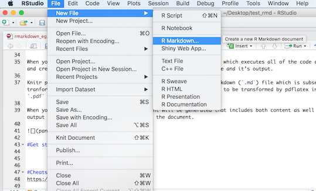
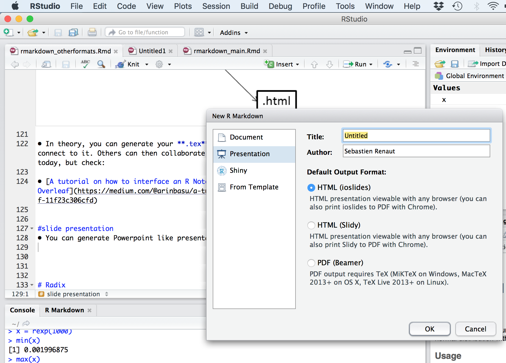

```{r setup, include=FALSE}
knitr::opts_chunk$set(echo = TRUE)
```

# Microsoft Word  
* You can specify it when you create a new `rmarkdown` document.  
  
* You can also specify it later in the YAML header.     

`---`  
`title: "rmarkdown_pdf_docx"`  
`author: "Sebastien Renaut"`  
`date: '2018-09-06'`  
`output: word_document`  
`---`    

* Then, it's just a matter of kniting the document!      

* Little documentation, few options & configurations are possible. (This is not the course of events that should be promoted, as it moves away from an open source environment).   

# Portable Document Format (.pdf)
* You need a extra step to go from LaTeX (*.tex*) format to a *.pdf*. This is handled by the `pdflatex` function in R.

* [LaTeX software](https://www.latex-project.org) is a high-quality typesetting system.  

* It is the *de facto* standard for the communication and publication of scientific documents.  

* LaTeX is available as free software.  

{width=500px}

* [Latex software](https://www.latex-project.org/get/) is available here.  

* If interested, follow this discussion: [*Why LaTeX is such a bloated system?*](https://ubuntuforums.org/showthread.php?t=395863)

* So...[*TinyTeX*](https://yihui.name/tinytex/r/) is a custom LaTeX distribution based on TeX Live that is small in size (~150MB) but functions well in most cases, especially for `R` users .

* `tinytex` R package is a wrapper function that installs *TinyTeX*.  

# Exercice 1 (15min.)
* Install the `tinytex` R package from the console.  
  
>install.packages("tinytex")  
>library(tinytex)  
>It takes a few minutes to download and compile tinytex (~150MB)  
>install_tinytex()  

* Compile your document as *.pdf*:  

>\---    
>title: "rmarkdown_pdf_docx"    
>author: "Sebastien Renaut"    
>date: '2018-09-06'    
>output: pdf_document    
>\---    

# More complex header
  
>\---    
>output   
>  pdf_document:  
>    keep_tex: true  
>    fig_caption: true  
>    latex_engine: pdflatex  
>title: "**This is my first Rmarkdown manuscript**"  
>date: `r format(Sys.time(), '%B %d, %Y')`  
>geometry: margin=1in  
>fontfamily: mathpazo  
>fontsize: 11pt  
>spacing: double  
>csl: ../reference_material/peerj.csl  
>bibliography: ../reference_material/reference.bib  
>\---    

* Note the indentation in the **.Rmd** document.     

* Note the bibliography file and csl file for formatting references.

# Exercice 2: R packages `rticles` (10min.) 
* This is a nice package to format articles according to the specification of a journal.  

* But first, you need to install it in the R console `install.packages("rticles")`.

>\```{r rticles, include=T}  
>#install.packages("rticles")  
>library(rticles)  
>\```    
  
* Once installed, try starting a new R markdown document according to your journal of interest.  
   
{width=500px}  
&nbsp;  
{width=500px}  
&nbsp;  
  
# Template (*.tex*)  
* You can build your own template if you know Latex...     

* There are many templates available on the web that you can use.  

* Here is one I like for [manuscripts](https://github.com/svmiller/svm-r-markdown-templates/blob/master/svm-latex-ms.tex) (Thanks svmiller!):  

* Here is one I like for [CVs](https://github.com/svmiller/svm-r-markdown-templates/blob/master/svm-latex-cv.tex):  

* Simply download it and add it to the YAML header like this: `template: ../reference_material/svm-latex-ms.tex`   

>\--- 
>output:  
>  pdf_document:  
>   keep_tex: true  
>   fig_caption: true  
>   latex_engine: pdflatex  
>   template: ../reference_material/svm-latex-ms.tex        
>title: "**This is my first Rmarkdown manuscript**  
>\---   

# Overleaf 
* Overleaf is an online LaTeX and Rich Text collaborative writing and publishing tool that makes the whole process of writing, editing and publishing scientific documents much quicker and easier.

{width=500px}
  
      
* Remember this:  
{width=500px}
  
* So you can generate your **.tex** file, upload it to a github repo and Overleaf will connect to it. Others can then collaborate and modify the .tex file. 

* Let's take a quick look at [overleaf](https://www.overleaf.com/). Once you have an overleaf account, you can connect it to a [github](https://www.github.com/) repository. You can then pull/push from overleaf to github, allowing others to modify your .tex file.

{width=500px}

* [A tutorial on how to interface an R Notebook with Overleaf](https://medium.com/@arinbasu/a-tutorial-on-how-to-interface-an-r-notebook-with-overleaf-11f23c306cfd)

* [How do I connect an Overleaf project with a repo on GitHub, GitLab or BitBucket?](https://www.overleaf.com/learn/how-to/How_do_I_connect_an_Overleaf_project_with_a_repo_on_GitHub,_GitLab_or_BitBucket%3F)

  
# Presentations
* You can also generate Powerpoint-like presentations.  
{width=400px}   


  
# Bookdown
* [Bookdown](https://bookdown.org/) {width=20px} is an open-source R package that facilitates writing books and long-form articles/reports with R Markdown.  

# Radix
* [Radix](https://blog.rstudio.com/2018/09/19/radix-for-r-markdown/) offers a better look for publishing blog, webpages, adapted to mobile devices.  
{width=500px}  

* You will need:   
  + [Rstudio v1.2][https://www.rstudio.com/products/rstudio/download/preview/].   
  + `radix`  

>\```{r radix, echo = T}    
>install.packages("radix")  
>\```  

  + Change output in header to:   
  
>\---  
>title: "Rmarkdown: radix"  
>author: "Sebastien Renaut"  
>output: radix::radix_article  
>\---  

  + Then you can start playing with the `radix` options, such as in this example below (full width figures):
    
>\```{r radix_example, echo = F, layout='l-screen-inset'}  
>library(leaflet)  
>leaflet() %>%  
>	addTiles() %>%   
>	addMarkers(lng=174.768, lat=-36.852,popup="The birthplace of R")  
>\```    
    
```{r radix_example, echo = F, eval = F, layout='l-screen-inset'}
library(leaflet)
leaflet() %>%
	addTiles() %>% 
	addMarkers(lng=174.768, lat=-36.852,popup="The birthplace of R")
```

