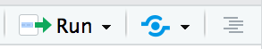

```{r setup, echo=T}
#install.packages("shiny")
library(shiny)
```

# What is Shiny?
* This `R Markdown` html document is made interactive using `shiny`. 

* `Shiny` allows you to create documents were readers can change the assumptions underlying your analysis and see the results immediately. 

* Look at this [example](https://gallery.shinyapps.io/087-crandash/) or [that one ](https://gallery.shinyapps.io/lake_erie_fisheries_stock_assessment_app/).

* See [gallery](https://shiny.rstudio.com/gallery/) for more examples.  

* To learn more, see [Interactive Documents](http://rmarkdown.rstudio.com/authoring_shiny.html).

# Set-up

## Header
```header
---  
title: "shiny_workshop"  
author: "Sebastien Renaut"  
date: "`r format(Sys.time(), '%B %d, %Y')`"  
output: html_document  
runtime: shiny  
---
```

## Viewing document with shiny  
* Run document (instead of Knit)

## Inputs and Outputs
* Output is automatically updated whenever inputs change.   

* The code below demonstrates how a standard plot can be made interactive by wrapping it in the Shiny `renderPlot` function (*output*). The `selectInput` and `sliderInput` functions create the *input* widgets used to generate plots.  


```{r eruptions, echo=T}
#Here we will use the faithful geyser example dataset to generate histogram and a density function.
knitr::kable(head(faithful),format = "markdown",digits =1,caption = "A motorcars table", align = "c") 

#SELECT INPUT
inputPanel(
  
  #selecting the type of input (n_breaks) for HISTOGRAM
  selectInput("n_breaks", label = "Number of bins:",
              choices = c(10, 20, 35, 50), selected = 20),
  
  #selecting the type of input (bw_adjust) for DENSITY FUNCTION
  sliderInput("bw_adjust", label = "Bandwidth adjustment:",
              min = 0.2, max = 2, value = 1, step = 0.2)
  
)

  #PLOTS
renderPlot({
  #An histogram of eruptions with breaks defined according to "selectInput"
  hist(faithful$eruptions, probability = TRUE, breaks = as.numeric(input$n_breaks),
       xlab = "Duration (minutes)", main = "Geyser eruption duration")
  
  #A density line of eruptions with adjustment defined according to "sliderInput"
  dens <- density(faithful$eruptions, adjust = input$bw_adjust)
  lines(dens, col = "blue")
})
```

## Embedded Application
* It's also possible to embed an entire Shiny application within an R Markdown document using the `shinyAppDir` function.  

```{r tabsets, echo=T}
shinyAppDir(
  system.file("examples/06_tabsets", package = "shiny"),
  options = list(
    width = "100%", height = 550
  )
)
```

* Note the use of the `height` parameter to determine how much vertical space the embedded application should occupy.  

## Another example
```{r mtcars, echo=T} 
# Define a User Interfacce for a "Miles per gallon" app using mtcars
knitr::kable(head(mtcars),digits =1,format = "markdown",caption = "An motorcars table", align = "c")

ui <- fluidPage(

  # App title
  titlePanel("Miles Per Gallon"),

  # Sidebar layout with input and output definitions
  sidebarLayout(

    # Sidebar panel for inputs
      sidebarPanel(

        # Input: Selector for variable to plot against mpgs
        selectInput("variable", "Variable:",c("Cylinders" = "cyl","Horse power" = "hp","Gears" = "gear"))
                  ),

      # Main panel for displaying outputs
      mainPanel(

        # Output: Plot of the requested variable against mpg
        plotOutput("mpgPlot")
                )
              )
  )

# Define server logic to plot various variables against mpg ----
server <- function(input, output) {

  #Generate a plot
  output$mpgPlot <- renderPlot({
    plot(as.formula(paste("mpg ~", input$variable)),data = mtcars,pch = 19,col = "darkred",main = paste("mpg ~", input$variable))
  })

}

# Return a Shiny app object
shinyApp(ui = ui, server = server,options=list(height = 550))
```  

# Deployment
* When you run a `shiny` document locally, it uses your local R session. Only you can see and interact with the document.   

* The power of `shiny` comes from a live R session running behind the scenes.

* You will have to deploy the document on a server, and share the URL of the document. Then other people only need a web browser to interact with your `shiny` app.

* Two ways to deploy a `shiny` document: 
  + Host it by service provided by **RStudio**
    + Technically easier.
    + webpage hosted on shinyapps.io
    + Freemium business model
  + Set up your own server
    +  Independence from *Rstudio*

# ShinyApps.io
* Sign up to http://www.shinyapps.io/ 

* Connect to the remote server (may need to install `rsconnect` and `packrat`)

* Also need to set remote account info
  + Once signed up, go to http://www.shinyapps.io/ >Account >Tokens >Show   

```rsconnect 
rsconnect::setAccountInfo(name='yourname',token='alphanumeric',secret='ASCII') 
```

* Publish document in Rtudio by clicking on *blue eye* {width=120px} at the top right corner. Voilà!  


